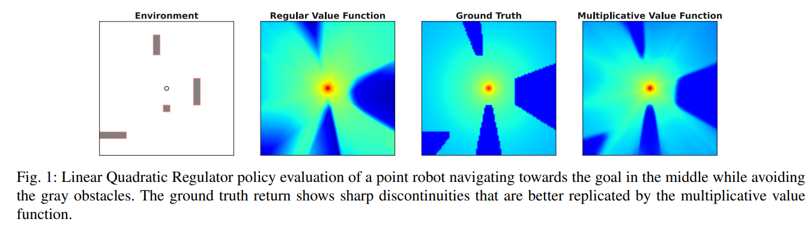

# A Multiplicative Value Function for Safe and Efficient Reinforcement Learning

This repo is for our paper `"A Multiplicative Value Function for Safe RL"` submitted to ICRA 2023.

**Authors**: Nick Bührer, Zhejun Zhang, Alexander Liniger, Fisher Yu and Luc Van Gool.

The paper can be found under todo <!---[[arXiv]](https://arxiv.org/abs/2209.13508)-->

## Abstract

An emerging field of sequential decision problems is safe Reinforcement Learning (RL), where the objective is to
maximize the reward while obeying safety constraints. Being able to handle constraints is essential for deploying RL
agents in real-world environments, where constraint violations can harm the agent and the environment. To this end, we
propose a safe model-free RL algorithm with a novel multiplicative value function consisting of a safety critic and a
reward critic. The safety critic predicts the probability of constraint violation and discounts the reward critic that
only estimates constraint-free returns. By splitting responsibilities, we facilitate the learning task leading to
increased sample efficiency. We integrate our approach into two popular RL algorithms, Proximal Policy Optimization and
Soft Actor-Critic, and evaluate our method in four safety-focused environments, including classical RL benchmarks
augmented with safety constraints and robot navigation tasks with images and raw Lidar scans as observations. Finally,
we make the zero-shot sim-to-real transfer where a differential drive robot has to navigate through a cluttered room.

<!----->

## Installation

The simplest way to install the dependencies is with the `conda_env.yaml`.

```bash
conda env create -f conda_env.yaml
```

Alternatively, we will provide a `requirement.txt` soon.
Note that our implementation is build upon [stable-baselines3 1.2.0](https://github.com/DLR-RM/stable-baselines3)
(as defined in the yaml) and might not work with newer versions.

## Running experiments

All the experiments can be launched from `main.py`. For the experiment configuration, we use
[hydra](https://github.com/facebookresearch/hydra). The following environments are supported for now:
- Lunar Lander Safe
- Car Racing Safe
- Point Robot Navigation

For running `PPO Mult V1` in `Lunar Lander Safe`, simply execute:
```bash
python main.py +lunar_lander=ppo_mult_v1
```
For executing the Lagrangian baseline `PPO Lagrange` in `Car Racing Safe`, simply execute:
```bash
python main.py +car_racing=ppo_lagrange
```

All the experiment configs can be found under the `experiments` folder. In the example of lunar lander, the experiment 
is under `experiments/lunar_lander/ppo_mult_v1.yaml`.

