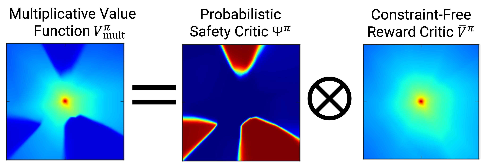

# Multiplicative Value Function for Safe RL

<p align="center">
     
     <br/>We propose a safe model-free RL algorithm with a novel multiplicative value function consisting of a safety critic and a reward critic. The safety critic predicts the probability of constraint violation and discounts the reward critic that only estimates constraint-free returns. By splitting responsibilities, we facilitate the learning task leading to increased sample efficiency.
     
</p>

> **A Multiplicative Value Function for Safe and Efficient Reinforcement Learning**            
> [Nick Bührer](https://www.linkedin.com/in/nick-b%C3%BChrer-250b46174/?originalSubdomain=sg), [Zhejun Zhang](https://zhejz.github.io/), [Alexander Liniger](https://alexliniger.github.io/), Fisher Yu and [Luc Van Gool](https://vision.ee.ethz.ch/people-details.OTAyMzM=.TGlzdC8zMjcxLC0xOTcxNDY1MTc4.html).<br/>
> 
> [IROS 2023](https://ieee-iros.org/)<br/>
> [Project Website with Videos](https://zhejz.github.io/saferl)<br/>
> [arXiv Paper](https://arxiv.org/abs/2303.04118)

```bibtex
@inproceedings{buehrer2023saferl,
  title     = {A Multiplicative Value Function for Safe and Efficient Reinforcement Learning},
  author    = {Nick B{\"u}hrer, Zhejun Zhang, Alexander Liniger, Fisher Yu, and Luc Van Gool},
  booktitle = {International Conference on Intelligent Robots and Systems (IROS)},
  year = {2023}
}
```

## Installation

Create the [conda](https://docs.conda.io/en/latest/miniconda.html) environment by running

```bash
conda env create -f conda_env.yaml
```

Note that our implementation is build upon [stable-baselines3 1.2.0](https://github.com/DLR-RM/stable-baselines3)
(as defined in the yaml) and might not work with newer versions.

## Running experiments

All the experiments can be launched from `main.py`. For the experiment configuration, we use
[hydra](https://github.com/facebookresearch/hydra). The following environments are supported for now:
- Lunar Lander Safe
- Car Racing Safe
- Point Robot Navigation

For running `PPO Mult V1` in `Lunar Lander Safe`, simply execute:
```bash
python main.py +lunar_lander=ppo_mult_v1
```
For executing the Lagrangian baseline `PPO Lagrange` in `Car Racing Safe`, simply execute:
```bash
python main.py +car_racing=ppo_lagrange
```

All the experiment configs can be found under the `experiments` folder. In the example of lunar lander, the experiment 
is under `experiments/lunar_lander/ppo_mult_v1.yaml`.

